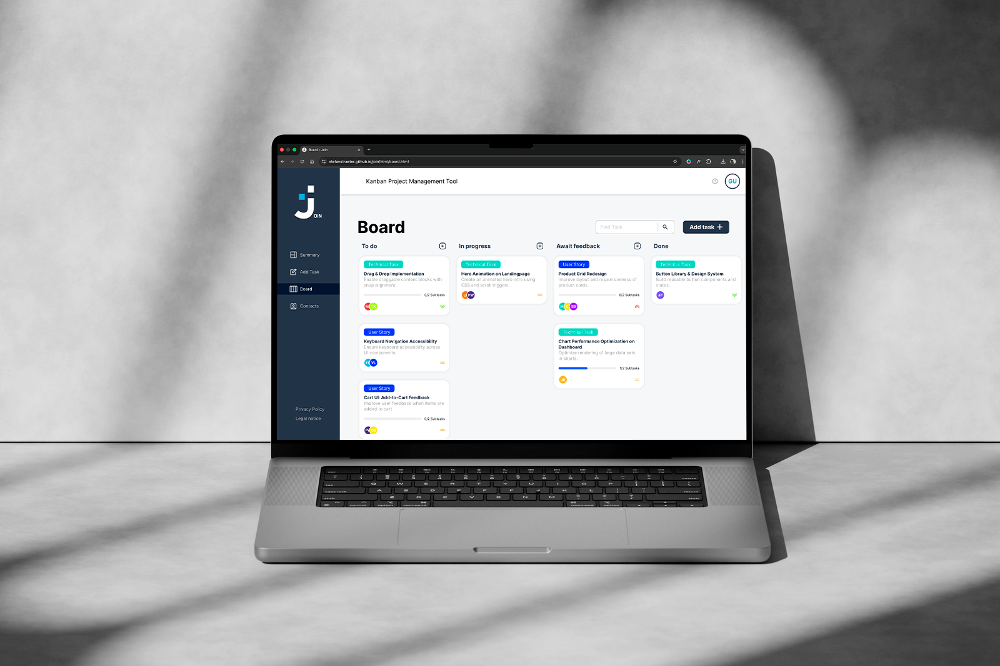

# JOIN

A framework-free Kanban board built with Vanilla JavaScript.

Manage tasks, track progress, and organize workflows directly in the browser – without relying on frontend frameworks.

🔗 **Live Demo:** https://stefanstraeter.github.io/join/

---

## Preview



---

## Features

- Drag & Drop Kanban board
- Task creation with priorities, due dates, and subtasks
- Contact management and task assignment
- Live search and filtering
- Visual subtask progress tracking
- Responsive design (desktop & mobile)
- Persistent data via Firebase + sessionStorage

---

## Purpose

This project was built to demonstrate how a complex frontend application can be implemented without using frameworks like React or Vue.

It focuses on:

- manual state management across multiple pages
- modular JavaScript architecture
- reusable UI patterns without component systems
- handling real-world UI complexity using only browser APIs

---

## Getting Started

Clone the repository:

```
git clone <repository-url>
cd join
```

Run the project using a local development server (e.g. VS Code Live Server).

> Note: The application requires a configured Firebase Realtime Database connection.

---

## Tech Stack

- HTML5
- CSS3 (Flexbox, responsive design)
- Vanilla JavaScript
- Firebase Realtime Database
- Session Storage (client-side caching)

---

## Project Structure

```
index.html
html/
scripts/
assets/templates/
styles/
```

- **index.html** – Authentication entry (login, signup, guest access)
- **html/** – Main application pages (Board, Summary, Contacts, etc.)
- **scripts/** – Domain-based logic (board, tasks, auth, contacts, utilities)
- **assets/templates/** – Reusable layout components (header, sidebar)
- **styles/** – Global and feature-specific styling

---

## Architecture Highlights

- **Framework-Free State Handling**
  Tasks, contacts, and user data are loaded, cached, updated, and rendered without external libraries.

- **Multi-Page Application Design**
  Consistent behavior across separate HTML pages through shared logic and initialization patterns.

- **Reusable Layout System**
  Header and sidebar are dynamically injected as templates.

- **Client + Remote Data Strategy**
  Firebase Realtime Database combined with `sessionStorage` for performance optimization.

- **Modular Code Organization**
  Clear separation between UI logic, domain logic, and utilities.

---

## Technical Challenges

### State Management Across Pages

Maintaining consistent state without a single-page architecture required careful separation of shared and page-specific logic.

### Firebase Synchronization

Combining remote data with local caching introduced challenges around consistency and UI updates.

### Reusability Without Frameworks

Reusable logic and UI behavior had to be designed manually without component systems.

### Interactive Board Logic

Implementing drag-and-drop, filtering, grouping, and dynamic rendering purely with DOM manipulation required structured logic and clean abstractions.

---

## Author

**Stefan Straeter**

GitHub: https://github.com/stefanstraeter/
